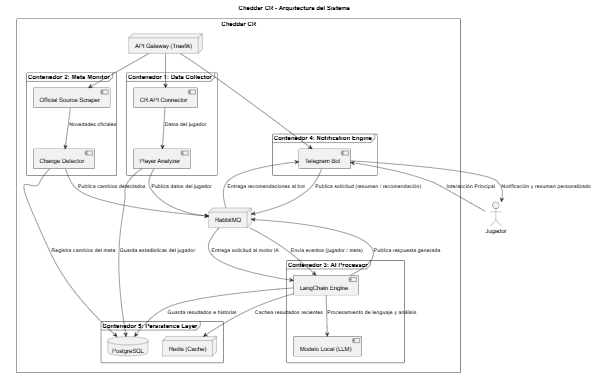

  

# Cheddar CR

## Descripción

Cheddar CR es un sistema inteligente que analiza el rendimiento de jugadores de Clash Royale y las tendencias del meta competitivo en tiempo real. Combina análisis de datos, procesamiento de lenguaje natural y notificaciones automatizadas mediante Telegram.

## Arquitectura general

## Componentes principales

1. **API Gateway (Traefik)**:
   Actúa como punto de entrada al sistema, redirige las peticiones del usuario o servicios externos al contenedor correspondiente
2. **Data Collector**:
   Se comunica con la API oficial de Clash Royale, obtiene datos del jugador (nivel, mazos, winrate, cartas desbloqueadas), procesa esa información para generar un perfil del jugador (fuerzas, debilidades, tendencias personales) mas informacion [aqui](data-collector\README.md)
3. **Meta Monitor**:
   Revisa fuentes oficiales del juego en busca de novedades, y publica estos hallazgos en para ser procesados por la IA
4. **AI Processor**:
   Coordina la lógica de análisis y generación de lenguaje natural, el Modelo Local (LLM): ejecuta el procesamiento del texto de manera local recibe datos desde RabbitMQ, los analiza, y produce salidas personalizadas
5. **Notification Engine**:
   Es la interfaz principal con el jugador, permite que el usuario consulte su estado actual o reciba salidas del AI Processor, obtiene alertas automáticas con las novedades detectadas
6. **Persistence Layer**:
   PostgreSQL almacena los datos persistentes como jugadores, historiales, configuraciones y resultados analizados. Redis (Cache), guarda temporalmente respuestas recientes o consultas frecuentes para acelerar el tiempo de respuesta del bot y evitar reprocesar información ya generada
7. **RabbitMQ**:
   Es el núcleo de la comunicación entre contenedores El bot pública solicitudes, los procesadores las recogen, las resuelven y devuelven los resultados

## Tecnologías

| Módulo              | Lenguaje | Frameworks / Tecnologías |
| ------------------- | -------- | ------------------------ |
| API Gateway         | Traefik  | Docker, Traefik          |
| Data Collector      | Python   | FastAPI, Requests        |
| Meta Monitor        | Python   | Scrapy, Celery           |
| AI Processor        | Python   | LangChain, Llama.cpp     |
| Notification Engine | Python   | python-telegram-bot      |
| Persistence         | -        | PostgreSQL, Redis        |
| Mensajería          | -        | RabbitMQ                 |

## Flujo de funcionamiento

1. El usuario interactúa con el bot de Telegram
2. El bot envía solicitudes al sistema vía RabbitMQ
3. El motor IA genera recomendaciones personalizadas
4. Los resultados se almacenan y notifican al jugador

## Autores

- Juan Sebastian Barajas Vargas
- Vitys Steeven Benavides Avila

## Licencia

Este proyecto se distribuye bajo la Licencia MIT, lo que permite su uso, modificación y distribución libre siempre que se mantenga el aviso de copyright.

Ver archivo [LICENSE](LICENSE) para más información.
